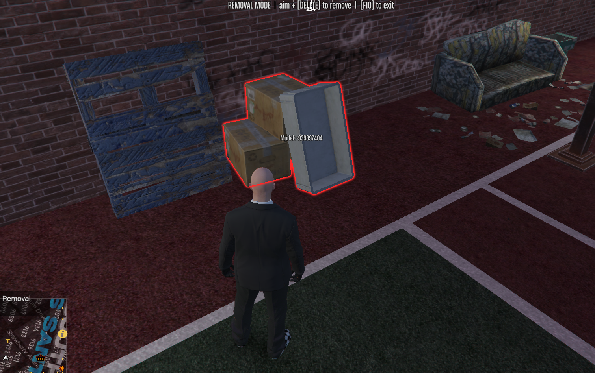

# fivem-prop-remover

> Admin-only, server-persistent world-prop remover for FiveM. Aim at an unwanted map prop, press a key, and it's gone — for **every** player, **permanently**, surviving restarts. With an ox_lib menu to review, teleport to, and restore anything you've removed.

[](LICENSE)


-
---



> *Removal mode in action: aim at any world prop, it lights up red with its model name, press **DELETE** — and it's gone for everyone, permanently.*

---

## What it does

Map/world props (a floating BBQ grill, a misplaced bench, leftover MLO clutter) aren't networked entities — every player streams them locally from the map data. That means there's **no pure server-side native** that can delete them once for everyone.

This resource solves that with the only architecture that actually works:

1. An admin aims at a prop in-game and deletes it.
2. The removal (model + coordinates + who/when) is sent to the server, where the admin's rank is **verified server-side**.
3. The server saves it to a JSON file and pushes the "kill-list" to **every connected client**.
4. On join and on every restart, the list is re-synced, so the prop stays gone for everyone forever.

A lightweight client loop re-deletes saved props as the map re-streams them, so they don't pop back when players walk away and return.

## Features

- 🎯 **Aim-and-delete** — raycast from your camera, with a red outline + live **readable model name** on whatever you're looking at.
- 📋 **Management menu (ox_lib)** — review every removed prop with its name, location and who/when. **Teleport** to any one, or **Restore** it individually (no more undo-only-the-last).
- 🧹 **Area wipe** — aim at a prop and clear *all* props of that model within a radius in one press (with a confirm dialog).
- 🔒 **Server-authoritative permissions** — every removal is validated on the server. Non-admins are rejected even if they tamper with the client. Plus light rate-limiting as defence in depth.
- 💾 **Permanent & global** — saved to JSON with per-prop metadata, synced to all players, survives restarts.
- 🧩 **Framework-agnostic** — ESX, QBCore, or standalone (ACE permissions). Switch with one config line.
- ♻️ **Re-stream proof** — maintenance loop keeps deleted props gone as the world reloads.
- ↩️ **Undo / clear** — `/undoprop` and `/clearprops`, plus per-prop restore from the menu.
- 🌍 **Localized** — ships with English, French, German, Spanish, Brazilian Portuguese and Italian (ox_lib locale system); add your own by dropping a `locales/<code>.json`.
- 🔔 **Update notifier** — the server console tells you when a newer GitHub release is out.
- 🛟 **Fallback for stubborn props** — if `DeleteEntity` refuses (some MLO-embedded props), the prop is shoved far under the map so it's out of sight.

## Requirements

- A FiveM server (artifact build with `fx_version 'cerulean'` or newer).
- **[ox_lib](https://github.com/overextended/ox_lib)** (menus, dialogs, notifications, locale).
- One of: **ESX**, **QBCore**, or nothing (standalone via ACE).

## Installation

1. Install [ox_lib](https://github.com/overextended/ox_lib) if you don't already have it.

2. Download or clone this repo into your server's `resources/` directory. The folder name **becomes the resource name** — keep it simple:

   ```bash
   cd resources
   git clone https://github.com/maverickphp/fivem-prop-remover.git prop_remover
   ```

   (Or drop the unzipped folder in manually and rename it to `prop_remover`.)

3. Add it to your `server.cfg`, **after** ox_lib and your framework:

   ```cfg
   ensure ox_lib
   ensure es_extended      # or qb-core
   ensure prop_remover
   ```

4. Configure permissions in [`config.lua`](config.lua) (see below). For **ACE / standalone** mode only, also add to `server.cfg`:

   ```cfg
   add_ace group.admin propremover.manage allow
   add_principal identifier.fivem:YOUR_ID group.admin
   ```

5. Restart the server (or `ensure prop_remover` from the console).

## Configuration

All settings live in [`config.lua`](config.lua). The important ones:

```lua
-- How admin status is checked: 'esx' | 'qbcore' | 'ace'
Config.PermissionMode = 'esx'

-- Who is allowed to remove props.
--   ESX groups:    'user', 'mod', 'admin', 'superadmin'
--   QBCore levels: 'user', 'mod', 'admin', 'god'
Config.AllowedGroups = { 'superadmin' }
```

| Setting | Default | Description |
|---------|---------|-------------|
| `Config.PermissionMode` | `'esx'` | `esx`, `qbcore`, or `ace` |
| `Config.AllowedGroups` | `{ 'superadmin' }` | Groups/levels allowed to remove props |
| `Config.ToggleKey` | `F10` | Toggle removal mode |
| `Config.DeleteKey` | `DELETE` | Delete the prop you're aiming at |
| `Config.MenuKey` | `F11` | Open the management menu |
| `Config.AreaWipeKey` | `HOME` | (in removal mode) area-wipe the aimed model |
| `Config.AreaWipeRadius` | `5.0` | Area-wipe radius (meters) |
| `Config.RayDistance` | `30.0` | Aim raycast reach (meters) |
| `Config.CleanupInterval` | `750` | ms between re-delete passes |
| `Config.StreamDistance` | `300.0` | Only re-delete saved props within this range |
| `Config.Locale` | `'en'` | Language: `en`, `fr`, `de`, `es`, `pt-br`, `it` |
| `Config.CheckUpdates` | `true` | Print to console if a newer release exists |

**Quick framework swap:**

- **ESX, admins too:** `Config.AllowedGroups = { 'superadmin', 'admin' }`
- **QBCore:** `Config.PermissionMode = 'qbcore'` and `Config.AllowedGroups = { 'god' }`
- **Standalone:** `Config.PermissionMode = 'ace'`

## Usage

1. Press **F10** (or type `/propremover`) to enter removal mode. You'll see an on-screen banner, and any prop you look at gets a red outline + its readable name.
2. Aim directly at the unwanted prop and press **DELETE** (or `/removeprop`). It vanishes instantly and is saved server-side.
3. Press **F11** (or `/propmenu`) to open the management menu — review everything you've removed, teleport to it, or restore it.

It's now gone for every player and stays gone after restarts.

| Command | Key | Who | Action |
|---------|-----|-----|--------|
| `/propremover` | F10 | admin | Toggle removal mode |
| `/removeprop` | DELETE | admin | Remove the prop you're aiming at |
| `/propmenu` | F11 | admin | Open the management menu (list / teleport / restore) |
| `/propareawipe` | HOME | admin | Area-wipe the aimed model (in removal mode) |
| `/undoprop` | — | admin | Un-save the most recent removal |
| `/clearprops` | — | admin | Un-save **all** removals |
| `/prophelp` | — | anyone | Show the controls |

## How removal behaves

When you delete a prop, one of three things happens — and each tells you what kind of prop it is:

- **Gone and stays gone** → it was a standalone ymap world prop. Done.
- **Flickers back briefly when you move away and return** → working as intended; the map re-streams it and the cleanup loop re-deletes it. Lower `Config.CleanupInterval` for snappier re-removal.
- **Doesn't delete / drops under the map** → it's an MLO-embedded or locked LOD prop. The under-map fallback hides it; a truly locked prop needs a [CodeWalker](https://github.com/dexyfex/CodeWalker) `.ymap` edit instead.

## Readable prop names

Labels and the menu show names like `prop_bbq_5` instead of raw hashes. GTA has thousands of props and a hash can't be reversed to text at runtime, so [`prop_names.lua`](prop_names.lua) ships a curated list that's hashed into a lookup at load. Anything not in the list still works — it just shows as its hash number. To get more readable names, append model names to that file.

## Project structure

```
prop_remover/
├── fxmanifest.lua          # resource manifest (declares ox_lib dependency)
├── config.lua              # all settings (shared)
├── prop_names.lua          # model-name list for readable labels (shared)
├── shared.lua              # hash -> name resolver (shared)
├── client.lua              # raycast, UI, menu, area wipe, cleanup loop
├── server.lua              # permissions, persistence, sync, update check
├── locales/
│   ├── en.json             # UI strings (English)
│   ├── fr.json             # French
│   ├── de.json             # German
│   ├── es.json             # Spanish
│   ├── pt-br.json          # Brazilian Portuguese
│   └── it.json             # Italian
└── data/
    └── removed_props.json  # the saved kill-list (auto-managed)
```

## Troubleshooting

- **Menu/notifications don't appear** — ox_lib isn't running or loads after this resource. Put `ensure ox_lib` above `ensure prop_remover`.
- **"You do not have permission"** — your account isn't in `Config.AllowedGroups`. For ESX, confirm your group; for ACE, check your `add_principal` line.
- **Resource won't start** — ensure it loads *after* ox_lib and your framework in `server.cfg`.
- **Nothing in crosshair** — aim *directly* at the prop and get within `Config.RayDistance` meters.
- **Prop keeps coming back** — it's re-streaming. It should flicker out within `Config.CleanupInterval` ms. If it never goes, it's likely a locked map prop needing a CodeWalker edit.

## License

[MIT](LICENSE) © [maverickphp](https://github.com/maverickphp)
